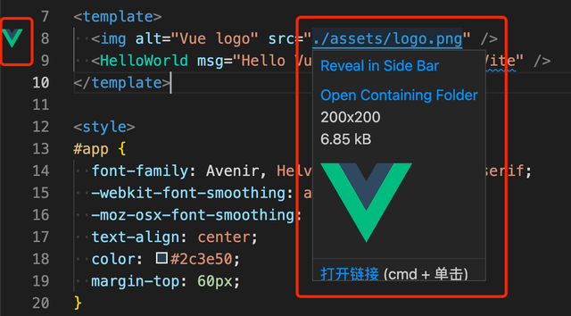
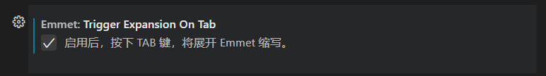

# 
 前端工具篇

## 1 开发工具

### 1.1 VScode

- 安装开发工具：[VScode](https://code.visualstudio.com/)
- 下载插件
  1. Chinese (Simplified) (简体中文) Language Pack for Visual Studio Code ，作用：显示中文
  1. Live Server ，作用：实时预览网页效果

        

  2. Image preview ，- 作用：悬停在图片链接时可以看到图片信息

        

- VSCode的基本快捷键

    1. 保存文件：ctrl + s
    2. 快速多选相同字符：ctrl + d ，选中要多选的字符，然后按ctrl + d即可连续选中
    1. 快速复制粘贴：alt+shit+↓ ，鼠标点击要复制的那一行，然后按上面的快捷键即可
    1. 快速生成结构标签：! + tab ，!必须是英文的，中文!无效，必须保证当前文件后缀名是.html，否则无效

 - 解决VScode按“感叹号+Tab”和直接按感叹号无法自动生成HTML模板的问题
    - 解决办法是：设置→搜索emmet→找到："Trigger Expansion On Tab" 打开就好了。然后就能用！+tab自动生成html模板

           

