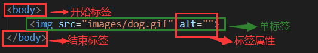
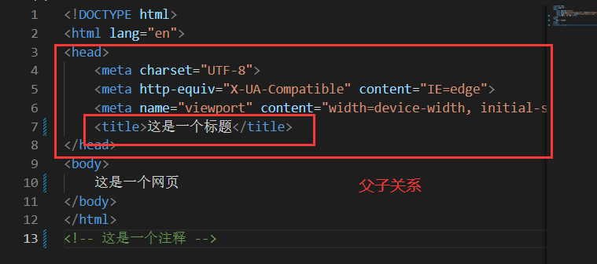
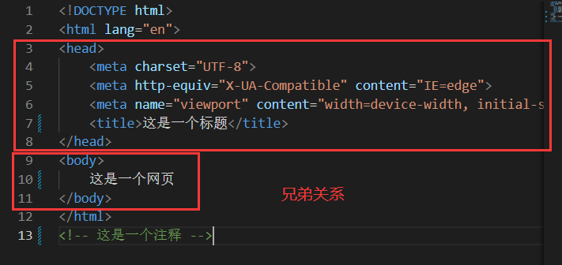
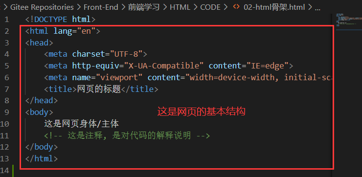

# 
 2 HTML 简介

## 2.1 HTML 概念

- HTML（Hyper Text Markup Language）中文译为：超文本标记语言，它是用来描述网页的一种语言
- HTML 不是一种编程语言，而是一种标记语言 (Markup Language)，标记语言是一套标记标签 
- HTML专门用于网页开发的语言，主要通过**HTML标签**对网页中的文本、图片、音频、视频等内容进行描述
- 所谓超文本，有 2 层含义：
  - 它可以加入图片、声音、动画、多媒体等内容（超越了文本限制 ）
  - 它还可以从一个文件跳转到另一个文件，与世界各地主机的文件连接（超级链接文本 ）

## 2.2 HTML 标签

- 标签的结构图

      

- 标签结构说明
  - 标签由<、>、/、英文单词或字母组成。并且把标签中<>包括起来的英文单词或字母称为标签名
  - 常见标签由两部分组成，我们称之为：双标签。前部分叫开始标签，后部分叫结束标签，两部分之间包裹内容
  - 少数标签由一部分组成，我们称之为：单标签。自成一体，无法包裹内容

- 标签属性说明
  - HTML 标签可以拥有属性。属性提供了有关 HTML 元素的更多的信息
  - 属性总是以名称/值对的形式出现，比如：name="value"
  - 标签的属性写在开始标签内部
  - 标签上可以同时存在多个属性，属性之间以空格隔开且属性之间没有顺序之分
  - 标签名与属性之间必须以空格隔开

## 2.3 HTML 标签关系

- 父子关系（嵌套关系）

      

- 兄弟关系（并列关系）

      

## 2.4 HTML 基本结构

- 每个网页都会有一个基本的结构标签（也称为骨架标签），页面内容也是在这些基本标签上书写

- HTML 基本结构由哪些标签组成？
  - html 标签：网页的整体
  - head标签：网页的头部
  - body标签：网页的身体
  - title 标签：网页的标题

- 在VScode 中使用快捷键：!+tab，创建第一个HTML网页，VScode的使用

      

## 2.5 HTML 注释

- 注释的作用
  - 为代码添加的具有解释性、描述性的信息，主要用来帮助开发人员理解代码
  - 浏览器执行代码时会忽略所有的注释

- 注释的快捷键
  - 在VS Code中：ctrl + /

## 2.6 VSCode 工具生成骨架标签新增代码

### 2.6.1 文档类型声明标签 

- `<!DOCTYPE>` 文档类型声明，作用就是告诉浏览器使用哪种HTML版本来显示网页
- `<!DOCTYPE html>`这句代码的意思是: 当前页面采取的是 HTML5 版本来显示网页
- `<!DOCTYPE>` 声明位于文档中的最前面的位置，处于 `<html>` 标签之前
- `<!DOCTYPE>`不是一个 HTML 标签，它是文档类型声明标签

### 2.6.2 lang 语言

- 用来定义当前文档显示的语言
- 简单来说,定义为en 就是英文网页, 定义为 zh-CN 就是中文网页
- 其实对于文档显示来说，定义成en的文档也可以显示中文，定义成zh-CN的文档也可以显示英文

### 2.6.3 charset 字符集

- 字符集 (Character set)是多个字符的集合。以便计算机能够识别和存储各种文字
- 在`<head>`标签内，可以通过`<meta>`标签的 charset 属性来规定 HTML 文档应该使用哪种字符编码
- charset 常用的值有：GB2312 、BIG5 、GBK 和 UTF-8，其中 UTF-8 也被称为万国码，基本包含了全世界所有国家需要用到的字符
- `<meta charset="UTF-8">`是必须要写的代码，否则可能引起乱码的情况。一般情况下，统一使用“UTF-8”编码，尽量统一写成标准的 "UTF-8"，不要写成 "utf8" 或 "UTF8"

