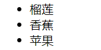
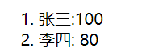
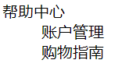

# 
7 列表标签

## 7.1 无序列表

- 场景：在网页中表示一组无顺序之分的列表
- 标签组成：

| 标签名 |                    说明                    |
| :----: | :----------------------------------------: |
|   ul   |     表示无序列表的整体，用于包裹li标签     |
|   li   | 表示无序列表的每一项，用于包含每一行的内容 |

- 显示特点：列表的每一项前默认显示圆点标识
- 注意点：
  - ul标签中只允许包含li标签
  - li标签可以包含任意内容
- 代码：

   ~~~html
   <ul>
       <li>榴莲</li>
       <li>香蕉</li>
       <li>苹果</li>
   </ul>
   ~~~

- 显示效果：

     

## 7.2 有序列表

- 场景：在网页中表示一组有顺序之分的列表
- 标签组成：

| 标签名 |                    说明                    |
| :----: | :----------------------------------------: |
|   ol   |     表示有序列表的整体，用于包裹li标签     |
|   li   | 表示有序列表的每一项，用于包含每一行的内容 |

- 显示特点：列表的每一项前默认显示序号标识
- 注意点：
  - ol标签中只允许包含li标签
  - li标签可以包含任意内容
- 代码：

    ~~~html
    <ol>
        <li>张三:100</li>
        <li>李四: 80</li>
    </ol>
    ~~~

- 显示效果：

     

## 7.3 自定义列表

- 场景：在网页的底部导航中通常会使用自定义列表实现 
- 标签组成：

| 标签名 |                  说明                   |
| :----: | :-------------------------------------: |
|   dl   | 表示自定义列表的整体，用于包裹dt/dd标签 |
|   dt   |          表示自定义列表的主题           |
|   dd   |  表示自定义列表的针对主题的每一项内容   |

- 显示特点：dd前会默认显示缩进效果
- 注意点：
  - dl标签中只允许包含dt/dd标签
  - dt/dd标签可以包含任意内容
- 代码：

     ~~~html
     <dl>
         <dt>帮助中心</dt>
           <dd>账户管理</dd>
           <dd>购物指南</dd>
     </dl>
     ~~~

- 显示效果：

     
