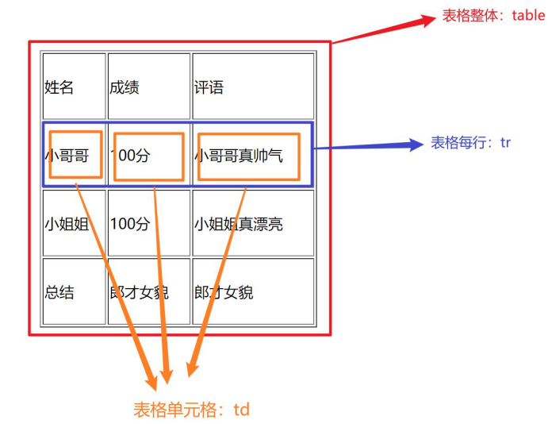
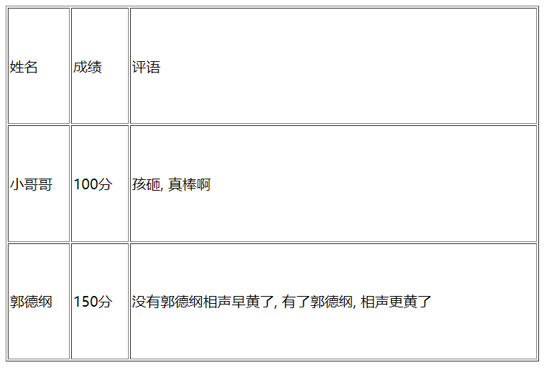
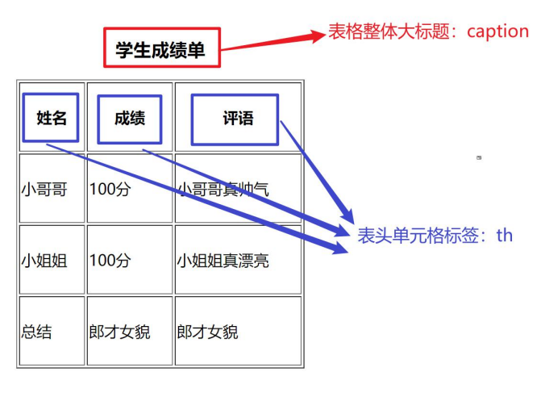
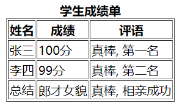
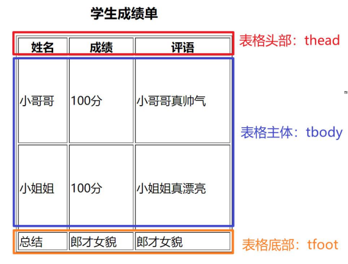
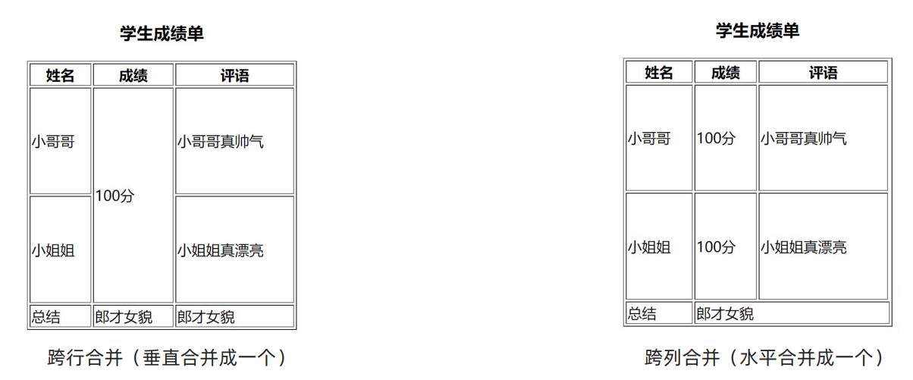
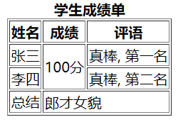

# 
8 表格标签

## 8.1 表格基本标签

- 场景：在网页中以行+列的单元格的方式整齐展示和数据，如：学生成绩表

      

- 基本标签：

| 标签名 |            说明            |
| :----: | :------------------------: |
| table  | 表格整体，可用于包裹多个tr |
|   tr   |   表格每行，可用于包裹td   |
|   td   | 表格单元格，可用于包裹内容 |

- 注意点：标签的嵌套关系：table > tr > td
- 代码：

    ~~~html
    <table border="1" width="600" height="400">
        <tr>
            <td>姓名</td>
            <td>成绩</td>
            <td>评语</td>
        </tr>

        <tr>
            <td>小哥哥</td>
            <td>100分</td>
            <td>孩砸, 真棒啊</td>
        </tr>

        <tr>
            <td>郭德纲</td>
            <td>150分</td>
            <td>没有郭德纲相声早黄了, 有了郭德纲, 相声更黄了</td>
        </tr>
    </table>
    ~~~
    
- 显示效果：

      

## 8.2 表格相关属性

- 场景：设置表格基本展示效果
- 常见相关属性：

| 属性名 | 属性值 |   效果   |
| :----: | :----: | :------: |
| border |  数字  | 边框宽度 |
| width  |  数字  | 表格宽度 |
| height |  数字  | 表格高度 |

- 注意点：实际开发时针对于样式效果推荐用CSS设置

## 8.3 表格标题和表头单元格标签

- 场景：在表格中表示整体大标题和一列小标题

      

- 标题和表头单元格标签

| 标签名  |    名称    |                              说明                              |
| :-----: | :--------: | :------------------------------------------------------------: |
| caption | 表格大标题 |       表示表格整体大标题，默认在表格整体顶部居中位置显示       |
|   th    | 表头单元格 | 表示一列小标题，通常用于表格第一行，默认内部文字加粗并居中显示 |

- 注意点：
  - caption标签书写在table标签内部
  - th标签书写在tr标签内部（用于替换td标签）
- 代码：

    ~~~html
    <table border="1">
        <caption><strong>学生成绩单</strong></caption>

        <tr>
            <th>姓名</th>
            <th>成绩</th>
            <th>评语</th>
        </tr>

        <tr>
            <td>张三</td>
            <td>100分</td>
            <td>真棒, 第一名</td>
        </tr>

        <tr>
            <td>李四</td>
            <td>99分</td>
            <td>真棒, 第二名</td>
        </tr>
        
        <tr>
            <td>总结</td>
            <td>郎才女貌</td>
            <td>真棒, 相亲成功</td>
        </tr>
    </table>
    ~~~

- 效果显示：

     

## 8.4 表格的结构标签

- 场景：让表格的内容结构分组，突出表格的不同部分（头部、主体、底部），使语义更加清晰

      

- 结构标签：

| 标签名 |   名称   |
| :----: | :------: |
| thead  | 表格头部 |
| tbody  | 表格主体 |
| tfoot  | 表格底部 |

- 注意点：
  - 表格结构标签内部用于包裹tr标签
  - 表格的结构标签可以省略
- 代码：

    ~~~html
    <table border="1">
        <caption><strong>学生成绩单</strong></caption>
        
        <thead>
            <tr>
                <th>姓名</th>
                <th>成绩</th>
                <th>评语</th>
            </tr>
        </thead>

        <tbody>
            <tr>
                <td>张三</td>
                <td>100分</td>
                <td>真棒, 第一名</td>
            </tr>
            <tr>
                <td>李四</td>
                <td>99分</td>
                <td>真棒, 第二名</td>
            </tr>    
        </tbody>

        <tfoot>
            <tr>
                <td>总结</td>
                <td>郎才女貌</td>
                <td>真棒, 相亲成功</td>
            </tr>
        </tfoot>
    </table>
    ~~~

- 显示效果：
      

## 8.5 合并单元格

- 场景：将水平或垂直多个单元格合并成一个单元格

      

- 合并单元格步骤：
  - 明确合并哪几个单元格
  - 通过左上原则，确定保留谁删除谁
    - 上下合并→只保留最上的，删除其他
    - 左右合并→只保留最左的，删除其他
  - 给保留的单元格设置：跨行合并（rowspan）或者跨列合并（colspan）

| 属性名  |      属性值      |               说明               |
| :-----: | :--------------: | :------------------------------: |
| rowspan | 合并单元格的个数 | 跨行合并，将多行的单元格垂直合并 |
| colspan | 合并单元格的个数 | 跨列合并，将多列的单元格水平合并 |

- 注意点：只有同一个结构标签中的单元格才能合并，不能跨结构标签合并（不能跨：thead、tbody、tfoot）
- 代码：

    ~~~html
    <table border="1">
        <caption><strong>学生成绩单</strong></caption>

        <thead>
            <tr>
                <th>姓名</th>
                <th>成绩</th>
                <th>评语</th>
            </tr>
        </thead>

        <tbody>
            <tr>
                <td>张三</td>
                <td rowspan="2">100分</td>
                <td>真棒, 第一名</td>
            </tr>
            <tr>
                <td>李四</td>
                <td>真棒, 第二名</td>
            </tr>    
        </tbody>
        
        <tfoot>
            <tr>
                <td>总结</td>
                <td colspan="2">郎才女貌</td>
            </tr>
        </tfoot>
    </table>
    ~~~

- 效果显示：

      

