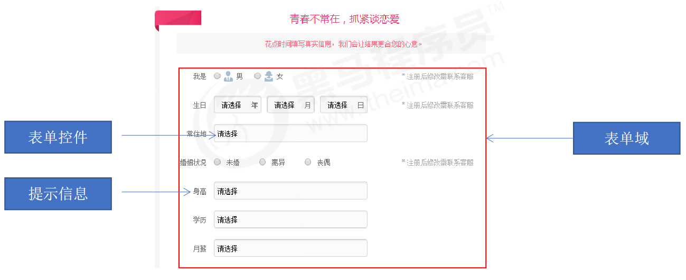
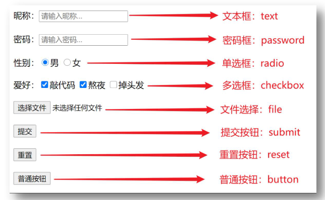
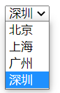
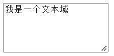

# 
9 表单标签

## 9.1 表单标签介绍

- 为什么需要表单？
  - 使用表单目的是为了收集用户信息。在我们网页中， 我们也需要跟用户进行交互，收集用户资料，此时就需要表单

- 表单的组成
  - 在 HTML 中，一个完整的表单通常由表单域、表单控件（也称为表单元素）和 提示信息3个部分构成

  

## 9.2 表单域

- 表单域是一个包含表单元素的区域。在 HTML 标签中，`<form>`标签用于定义表单域，以实现用户信息的收集和传递，`<form>` 会把它范围内的表单元素信息提交给服务器

    ~~~html
    <form action=“url地址” method=“提交方式” name=“表单域名称">
    各种表单元素控件
    </form>
    ~~~

- 常用属性

|  属性  |  属性值  |                        作用                        |
| :----: | :------: | :------------------------------------------------: |
| action | url地址  |  用于指定接收并处理表单数据的服务器程序的url地址   |
| method | get/post |   用于设置表单数据的提交方式，其取值为get或post    |
|  name  |   名称   | 用于指定表单的名称，以区分同一个页面中的多个表单域 |

## 9.3 input 标签

- 在英文单词中，input 是输入的意思，而在表单元素中`<input>`标签用于收集用户信息
- 在`<input>`标签中，包含一个 type 属性，根据不同的 type 属性值，输入字段拥有很多种形式（可以是文本字段、复选框、掩码后的文本控件、单选按钮、按钮等）

    ~~~html
    <input type="属性值" >
    ~~~

      

    ~~~html
    <form action="">
        <!-- 写什么就显示什么 -->
        昵称: <input type="text" placeholder="请输入昵称">
          

        <!-- 书写的内容都会变成点点显示 -->
        密码: <input type="password" placeholder="请输入密码">
          

        <!-- name属性对于单选框有分组功能，有相同name属性值的单选框为一组，一组中只能同时有一个被选中 -->
        性别: <input type="radio" name="sex">男
            <input type="radio" name="sex">女
          

        爱好: <input type="checkbox" checked>敲代码
            <input type="checkbox" checked>熬夜
            <input type="checkbox">掉头发
              

        上传文件: <input type="file">
          

        <input type="submit">
          

        <input type="reset">
          

        <!-- 要改变按钮里面的文字，使用value属性即可，提交和重置按钮同理 -->
        <input type="button" value="普通按钮">
    </form>
    ~~~

- type 属性的属性值及其描述如下

| 标签名 |   type   |                属性值说明                |
| :----: | :------: | :--------------------------------------: |
| input  |   text   |         文本框，用于输入单行文本         |
| input  | password |           密码框，用于输入密码，改字段中的字符会被掩盖           |
| input  |  radio   |            单选框，用于多选一            |
| input  | checkbox |            多选框，用于多选多            |
| input  |   file   |        文件选择，用于之后上传文件        |
| input  |  submit  |            提交按钮，用于提交            |
| input  |  reset   |            重置按钮，用于重置            |
| input  |  button  | 普通按钮，默认无功能，之后配合js添加功能 |

- 除 type 属性外，`<input>`标签还有其他很多属性，其常用属性如下

|    属性     |    属性值    |                描述                 |
| :---------: | :----------: | :---------------------------------: |
| placeholder | 由用户自定义 |   占位符，提示用户输入内容的文本    |
|    name     | 由用户自定义 |         定义input元素的名称         |
|    value    | 由用户自定义 |          规定input元素的值          |
|   checked   |   checked    | 规定此input元素首次加载时应当被选中 |
|  maxlength  |    正整数    |   规定输入字段中的字符的最大长度    |

- placeholder 一般用于文本框和密码框，用来提示用户输入内容

- value属性和name属性作用介绍
   - value属性：用户输入的内容，提交之后会发送给后端服务器
   - name属性：当前控件的含义，提交之后可以告诉后端发送过去的数据是什么含义
   - 后端接收到数据的格式是：name的属性值 = value的属性值

- name属性对于单选框有分组功能，有相同name属性值的单选框为一组，一组中只能同时有一个被选中

- checked属性主要针对于单选按钮和复选框, 主要作用一打开页面,就要可以默认选中某个表单元素

- maxlength 是用户可以在表单元素输入的最大字符数, 一般较少使用

## 9.4 label 标签

- `<label>`标签用于绑定一个表单元素, 当点击`<label>`标签内的文本时，浏览器就会自动将焦点(光标)转到或者选择对应的表单元素上,用来增加用户体验
- 使用方法①：
     - 使用label标签把内容（如：文本）包裹起来
     - 在表单标签上添加id属性
     - 在label标签的for属性中设置对应的id属性值
- 使用方法②（推荐）：
     - 直接使用label标签把内容（如：文本）和表单标签一起包裹起来
     - 需要把label标签的for属性删除即可
- 代码：
    ~~~html
    <!-- 将男和女与单选框绑定关系后，现在点击男女字体也可以选中，不需要点中圆形框 -->
    性别: 
    <input type="radio" name="sex" id="nan"> <label for="nan">男</label>
    <label><input type="radio" name="sex"> 女</label>
    ~~~

## 9.5 select 下拉菜单标签

- 场景：在网页中提供多个选择项的下拉菜单表单控件
- 标签组成：
  - select标签：下拉菜单的整体
  - option标签：下拉菜单的每一项
- 常见属性：
  - selected：下拉菜单的默认选中
- 代码：

     ~~~html
     <select>
         <option>北京</option>
         <option>上海</option>
         <option>广州</option>
         <option selected>深圳</option>
     </select>
     ~~~

- 显示效果：

       

## 9.6 textarea 文本域标签

- 场景：在网页中提供可输入多行文本的表单控件
- 标签名：textarea
- 常见属性：
    - cols：规定了文本域内可见宽度
    - rows：规定了文本域内可见行数
- 注意点：
    - 右下角可以拖拽改变大小
    - 实际开发时针对于样式效果推荐用CSS设置
- 代码：

    ~~~html
    <textarea cols="20" rows="5">我是一个文本域</textarea>
    ~~~
    
- 显示效果：

      