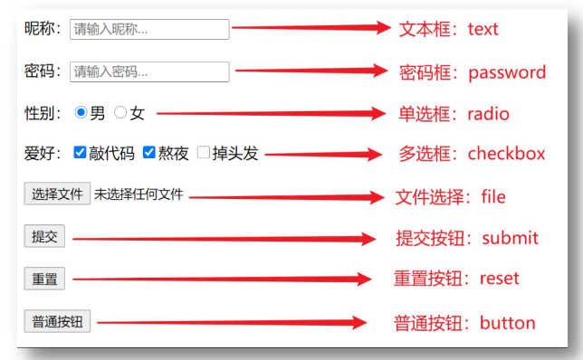
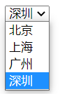
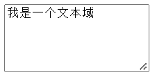

# HTML基础

- **学习目标**
  1. 能够理解HTML的 基本语法 和标签的关系  
  2. 能够使用 排版标签 实现网页中标题、段落等效果
  3. 能够使用 相对路径 选择不同目录下的文件
  4. 能够使用 媒体标签 在网页中显示图片、播放音频和视频
  5. 能够使用 链接标签 实现页面跳转功能
  6. 能够使用 列表标签 实现网页中列表结构的搭建
  7. 能够使用 表格标签及属性 实现网页中表格结构的搭建
  8. 能够使用 表单标签及属性 实现表单类网页结构搭建
  9. 能够认识常见 布局标签 的显示特点
  10. 能够使用 字符实体 在网页中显示空格、大于号和小于号

## 基础认识

- **认识网页**
  1. 问题1：网页由哪些部分组成？
   文字、图片、音频、视频、超链接
  2. 问题2：我们看到的网页背后本质是什么？
   前端程序员写的代码
  3. 问题3：前端的代码是通过什么软件转换成用户眼中的页面的？
   通过浏览器转化（解析和渲染）成用户看到的网页

- **五大浏览器和渲染引擎**
  - 五大浏览器
     1. 浏览器：是网页显示、运行的平台，是前端开发必备利器
     2. 常见的五大浏览器：IE浏览器、火狐浏览器（Firefox）、谷歌浏览器（Chrome）、Safari浏览器、欧朋浏览器（Opera）
   
  - 渲染引擎
     1. 渲染引擎（浏览器内核）：浏览器中专门对代码进行解析渲染的部分
     2. 浏览器出品的公司不同，内在的渲染引擎也是不同的

        |    浏览器    |  内核   |                  备注                   |
        | :----------: | :-----: | :-------------------------------------: |
        |      IE      | Trident | IE、猎豹安全、360极速浏览器、百度浏览器 |
        |   FireFox    |  Gecko  |             火狐浏览器内核              |
        |    Safari    | Webkit  |             苹果浏览器内核              |
        | Chrome/Opera |  Blink  |         Blink其实是Webkit的分支         |

    1. 注意点：
       - 渲染引擎不同，导致解析相同代码时的 速度、性能、效果也不同的
       - 谷歌浏览器的渲染引擎速度快、性能高、效果好，所以更吸引用户的喜爱（推荐）

-  **Web标准**
     - **为什么需要Web标准？**
       1. 不同浏览器的渲染引擎不同，对于相同代码解析的效果会存在差异，如果用户想看一个网页，结果用不同浏览器打开效果不同，用户体验极差
       2. Web标准：让不同的浏览器按照相同的标准显示结果，让展示的效果统一

     - **Web标准的构成**

        | 构成 |    语言    |                        说明                        |
        | :--: | :--------: | :------------------------------------------------: |
        | 结构 |    HTML    |                   页面元素和内容                   |
        | 表现 |    CSS     | 网页元素的外观和位置等页面样式（如：颜色、大小等） |
        | 行为 | JavaScript |              网页模型的定义与页面交互              |

-  **HTML的概念**

     - HTML（Hyper Text Markup Language）中文译为：超文本标记语言，它是用来描述网页的一种语言
     - HTML 不是一种编程语言，而是一种标记语言 (Markup Language)，标记语言是一套标记标签 
     - HTML专门用于网页开发的语言，主要通过**HTML标签**对网页中的文本、图片、音频、视频等内容进行描述
     - 所谓超文本，有 2 层含义：
        1. 它可以加入图片、声音、动画、多媒体等内容（超越了文本限制 ）
        2. 它还可以从一个文件跳转到另一个文件，与世界各地主机的文件连接（超级链接文本 ）

-  **HTML骨架结构**

     1. 网页类似于一篇文章：每一页文章内容是有固定的结构的，如：开头、正文、落款等……
     2. 网页中也是存在固定的结构的，如：整体、头部、标题、主体，网页中的固定结构是要通过特点的 HTML标签 进行描述的
     3. HTML骨架结构由哪些标签组成？
        - html标签：网页的整体
        - head标签：网页的头部
        - body标签：网页的身体
        - title标签：网页的标题

           

## HTML注释及标签相关概念

-  **HTML的注释**
     1. 注释的作用
        - 为代码添加的具有解释性、描述性的信息，主要用来帮助开发人员理解代码
        - 浏览器执行代码时会忽略所有的注释
     2. 注释的快捷键
        - 在VS Code中：ctrl + /

- **HTML标签的构成**
     1. 标签的结构图

          

     2. 标签结构说明
         - 标签由<、>、/、英文单词或字母组成。并且把标签中<>包括起来的英文单词或字母称为标签名
         - 常见标签由两部分组成，我们称之为：双标签。前部分叫开始标签，后部分叫结束标签，两部分之间包裹内容
         - 少数标签由一部分组成，我们称之为：单标签。自成一体，无法包裹内容
     2. 标签属性说明
          - HTML 标签可以拥有属性。属性提供了有关 HTML 元素的更多的信息
          - 属性总是以名称/值对的形式出现，比如：name="value"
          - 属性总是在 HTML 元素的开始标签中规定

- **HTML标签的关系**
    1. 父子关系（嵌套关系）

          

    2. 兄弟关系（并列关系）

          

## 排版标签

### 标题标签

 1. 场景：在新闻和文章的页面中，都离不开标题，用来突出显示文章主题
 2. 代码：h系列标签
     ~~~html{.line-numbers}
     <h1>1级标题</h1>
     <h2>2级标题</h2>
     <h3>3级标题</h3>
     <h4>4级标题</h4>
     <h5>5级标题</h5>
     <h6>6级标题</h6>
     ~~~
 3. 语义：1~6级标题，重要程度依次递减
 4. 特点：
    - 文字都有加粗
    - 文字都有变大，并且从h1 → h6文字逐渐减小
    - 独占一行
 5. 注意点：h1标签对于网页尤为重要，开发中有特定的使用场景，如：新闻的标题、网页的logo部分

### 段落标签

 1. 场景：在新闻和文章的页面中，用于分段显示
 2. 代码：`
我是一段文字
`
 3. 语义：段落
 4. 特点：
    - 段落之间存在间隙
    - 独占一行

### 换行标签

  1. 场景：让文字强制换行显示
  2. 代码：` `
  3. 语义：换行
  4. 特点：
       - 单标签
       - 让文字强制换行

### 水平线标签

 1. 场景：分割不同主题内容的水平线
 2. 代码：`
`
 3. 语义：主题的分割转换
 4. 特点：
    - 单标签
    - 在页面中显示一条水平线

## 文本格式化标签

- **文本格式化标签的介绍**
  1. 场景：需要让文字加粗、下划线、倾斜、删除线等效果
  2. 代码：

    

  3. 语义：突出重要性的强调语境

 - **标签语义化**
    1. 实际项目开发中选择标签的原则：标签语义化
        - 即：根据语义选择对应正确的标签
        - 如：需要写标题，就使用h系列标签
        - 如：需要写段落，就使用p标签

    2. 好处：
         - 对人：好理解，好记忆
         - 对机器：有利于机器解析，对搜索引擎（SEO）有帮助

    3. 推荐：
         - strong、ins、em、del，表示的强调语义更强烈！

## 媒体标签

### 图片标签
  - **图片标签的介绍**
     1. 场景：在网页中显示图片
     2. 代码：``
     3. 特点：
         - 单标签
         - img标签需要展示对应的效果，需要借助标签的属性进行设置！

    1. 标签的完整结构图：

         

    2. 属性注意点：
       - 标签的属性写在开始标签内部
       - 标签上可以同时存在多个属性
       - 属性之间以空格隔开
       - 标签名与属性之间必须以空格隔开
       - 属性之间没有顺序之分

    3. 图片标签常见的属性

        |  属性  |                   说明                   |
        | :----: | :--------------------------------------: |
        |  src   |          指定需要展示图片的路径          |
        |  alt   | 替换文本，当图片加载失败时，才显示的文字 |
        | title  |   提示文本，当鼠标悬停时，才显示的文字   |
        | width  |                图片的宽度                |
        | height |                图片的高度                |

  - **图片标签的src属性**
    1. 属性名：src
    2. 属性值：目标图片的路径
    3. 注意点：
       - 当前网页和目标图片在同一个文件夹中，路径直接写目标图片的名字即可（包括后缀名）
       - 路径的情况有很多，稍后会详细介绍

  - **图片标签的alt属性**
    1. 属性名：alt
    2. 属性值：替换文本
       - 当图片加载失败时，才显示alt的文本
       - 当图片加载成功时，不会显示alt的文本

        

  - **图片标签的title属性**
    1.  属性名：title
    2.  属性值：提示文本
        - 当鼠标悬停时，才显示的文本
    1.  注意点：title属性不仅仅可以用于图片标签，还可以用于其他标签

      

  - **图片标签的width和height属性**
    1. 属性名：width和height
    2. 属性值：宽度和高度（数字）
    3. 注意点：
       - 如果只设置width或height中的一个，另一个没设置的会自动等比例缩放（此时图片不会变形）
       - 如果同时设置了width和height两个，若设置不当此时图片可能会变形

- **路径**
  - **路径的介绍**
    1. 场景：页面需要加载图片，需要先找到对应的图片
    2. 类似于：生活中两个人，我要去找你，需要通过一定的路径才能找到
    3. 同理：页面需要找到图片，也是需要通过路径才能找到
    4. 路径可分为：
       - 绝对路径
       - 相对路径

  - **绝对路径**
    1. 绝对路径：指目录下的绝对位置，可直接到达目标位置，通常从盘符开始的路径
    2. 例如：
       - 盘符开头：D:\day01\images\1.jpg
       - 完整的网络地址：https://www.itcast.cn/2018czgw/images/logo.gif（了解）

  - **相对路径**
      1. 相对路径：从当前文件开始出发找目标文件的过程

      2. 相对路径分类：
         - 同级目录：当前文件和目标文件在同一目录中
         - 下级目录：目标文件在下级目录中
         - 上级目录：目标文件在上级目录中

      3. VSCode中路径的快捷操作？
         - 同级和下级目录：./ 之后选择即可
         - 上级目录：../ 之后选择即可

### 音频标签

  1. 场景：在页面中插入音频
  2. 代码：`<audio src="./music.mp3" controls autoplay loop></audio>`
  3. 常见属性：

      |  属性名  |            功能             |
      | :------: | :-------------------------: |
      |   src    |         音频的路径          |
      | controls |       显示播放的控件        |
      | autoplay | 自动播放（部分浏览器不支持) |
      |   loop   |          循环播放           |

  4. 注意点：
       - 音频标签目前支持三种格式：MP3、Wav、Ogg

### 视频标签

  1. 场景：在页面中插入视频
  2. 代码：`<video src="./video.mp4" controls autoplay muted loop></video>`
  3. 常见属性：

        |  属性名  |                      功能                      |
        | :------: | :--------------------------------------------: |
        |   src    |                   视频的路径                   |
        | controls |                 显示播放的控件                 |
        | autoplay | 自动播放（谷歌浏览器中需配合muted实现静音播放) |
        |   loop   |                    循环播放                    |

  4. 注意点：
     - 视频标签目前支持三种格式：MP4 、WebM 、Ogg

## 链接标签

  - **链接标签的介绍**
    1. 场景：点击之后，从一个页面跳转到另一个页面
    <a href="https://www.baidu.com/" target="_blank">跳转到百度</a>
    2. 称呼： a标签、超链接、锚链接
    3. 代码：
        ~~~html{.line-numbers}
        <a href="https://www.baidu.com/" target="_blank">跳转到百度</a>
        ~~~
    4. 特点：
       - 双标签，内部可以包裹内容
       - 如果需要a标签点击之后去指定页面，需要设置a标签的href属性

    5. 常见属性

        |  属性  |        功能        |
        | :----: | :----------------: |
        |  href  |   目标网页的路径   |
        | target | 目标网页的打开形式 |

  - **链接标签的href属性**

    1. 属性名：href
    2. 属性值：点击之后跳转去哪一个网页（目标网页的路径）

          

  - **链接标签的target属性**

    1. 属性名：target
    2. 属性值：目标网页的打开形式

        |  取值  |                 效果                  |
        | :----: | :-----------------------------------: |
        | _self  | 默认值，在当前窗口中跳转（覆盖原网页) |
        | _blank |      在新窗口中跳转（保留原网页)      |

  - **空链接**

    1. 代码：`<a href="#">空链接</a>`
    2. 功能：
       - 点击之后回到网页顶部
       - 开发中不确定该链接最终跳转位置，用空链接占个位置

  - **链接标签的显示特点**

    1. a标签默认文字有下划线
    2. a标签从未点击过，默认文字显示蓝色
    3. a标签点击过之后，文字显示为紫色（清除浏览器历史记录可恢复蓝色）

## 列表标签

### 无序列表

  1. 场景：在网页中表示一组无顺序之分的列表
  2. 标签组成：

      | 标签名 |                    说明                    |
      | :----: | :----------------------------------------: |
      |   ul   |     表示无序列表的整体，用于包裹li标签     |
      |   li   | 表示无序列表的每一项，用于包含每一行的内容 |

  3. 显示特点：
     - 列表的每一项前默认显示圆点标识
  4. 注意点：
     - ul标签中只允许包含li标签
     - li标签可以包含任意内容

  5. 代码：
      ~~~html{.line-numbers}
      <ul>
          <li>榴莲</li>
          <li>香蕉</li>
          <li>苹果</li>
      </ul>
      ~~~
  6. 显示效果：

        

### 有序列表

  1. 场景：在网页中表示一组有顺序之分的列表
  2. 标签组成：

      | 标签名 |                    说明                    |
      | :----: | :----------------------------------------: |
      |   ol   |     表示有序列表的整体，用于包裹li标签     |
      |   li   | 表示有序列表的每一项，用于包含每一行的内容 |

  3. 显示特点：
     - 列表的每一项前默认显示序号标识
  4. 注意点：
     - ol标签中只允许包含li标签
     - li标签可以包含任意内容

  5. 代码：
      ~~~html{.line-numbers}
      <ol>
          <li>张三:100</li>
          <li>李四: 80</li>
      </ol>
      ~~~
  6. 显示效果：

        

### 自定义列表

  1. 场景：在网页的底部导航中通常会使用自定义列表实现 
  2. 标签组成：

      | 标签名 |                  说明                   |
      | :----: | :-------------------------------------: |
      |   dl   | 表示自定义列表的整体，用于包裹dt/dd标签 |
      |   dt   |          表示自定义列表的主题           |
      |   dd   |  表示自定义列表的针对主题的每一项内容   |

  3. 显示特点：
     - dd前会默认显示缩进效果
  4. 注意点：
     - dl标签中只允许包含dt/dd标签
     - dt/dd标签可以包含任意内容
  5. 代码：
        ~~~html{.line-numbers}
        <dl>
            <dt>帮助中心</dt>
              <dd>账户管理</dd>
              <dd>购物指南</dd>
        </dl>
        ~~~
 1. 显示效果：

       

## 表格标签

### 表格的基本标签

  1. 场景：在网页中以行+列的单元格的方式整齐展示和数据，如：学生成绩表

        

  2. 基本标签：

      | 标签名 |            说明            |
      | :----: | :------------------------: |
      | table  | 表格整体，可用于包裹多个tr |
      |   tr   |   表格每行，可用于包裹td   |
      |   td   | 表格单元格，可用于包裹内容 |

  3. 注意点：
     - 标签的嵌套关系：table > tr > td

  4. 代码：
      ~~~html{.line-numbers}
      <table border="1" width="600" height="400">
          <tr>
              <td>姓名</td>
              <td>成绩</td>
              <td>评语</td>
          </tr>

          <tr>
              <td>小哥哥</td>
              <td>100分</td>
              <td>孩砸, 真棒啊</td>
          </tr>

          <tr>
              <td>郭德纲</td>
              <td>150分</td>
              <td>没有郭德纲相声早黄了, 有了郭德纲, 相声更黄了</td>
          </tr>
      </table>
      ~~~

  5. 显示效果：

        

### 表格相关属性

  1. 场景：设置表格基本展示效果
  2. 常见相关属性：

      | 属性名 | 属性值 |   效果   |
      | :----: | :----: | :------: |
      | border |  数字  | 边框宽度 |
      | width  |  数字  | 表格宽度 |
      | height |  数字  | 表格高度 |

  3. 注意点：
     - 实际开发时针对于样式效果推荐用CSS设置

### 表格标题和表头单元格标签

  1. 场景：在表格中表示整体大标题和一列小标题

        

    
  2. 结构标签

      | 标签名  |    名称    |                              说明                              |
      | :-----: | :--------: | :------------------------------------------------------------: |
      | caption | 表格大标题 |       表示表格整体大标题，默认在表格整体顶部居中位置显示       |
      |   th    | 表头单元格 | 表示一列小标题，通常用于表格第一行，默认内部文字加粗并居中显示 |

  3. 注意点：
     - caption标签书写在table标签内部
     - th标签书写在tr标签内部（用于替换td标签）

  4. 代码：
      ~~~html{.line-numbers}
      <table border="1">
          <caption><strong>学生成绩单</strong></caption>

          <tr>
              <!-- <td></td> -->
              <th>姓名</th>
              <th>成绩</th>
              <th>评语</th>
          </tr>

          <tr>
              <td>张三</td>
              <td>100分</td>
              <td>真棒, 第一名</td>
          </tr>

          <tr>
              <td>李四</td>
              <td>99分</td>
              <td>真棒, 第二名</td>
          </tr>
          
          <tr>
              <td>总结</td>
              <td>郎才女貌</td>
              <td>真棒, 相亲成功</td>
          </tr>
      </table>
      ~~~

  5. 效果显示：

        

### 表格的结构标签

  1. 场景：让表格的内容结构分组，突出表格的不同部分（头部、主体、底部），使语义更加清晰

        

  2. 结构标签：

      | 标签名 |   名称   |
      | :----: | :------: |
      | thead  | 表格头部 |
      | tbody  | 表格主体 |
      | tfoot  | 表格底部 |

  3. 注意点：
     - 表格结构标签内部用于包裹tr标签
     - 表格的结构标签可以省略

  4. 代码：
      ~~~html{.line-numbers}
      <table border="1">
          <caption><strong>学生成绩单</strong></caption>
          
          <thead>
              <tr>
                  <!-- <td></td> -->
                  <th>姓名</th>
                  <th>成绩</th>
                  <th>评语</th>
              </tr>
          </thead>

          <tbody>
              <tr>
                  <td>张三</td>
                  <td>100分</td>
                  <td>真棒, 第一名</td>
              </tr>
              <tr>
                  <td>李四</td>
                  <td>99分</td>
                  <td>真棒, 第二名</td>
              </tr>    
          </tbody>

          <tfoot>
              <tr>
                  <td>总结</td>
                  <td>郎才女貌</td>
                  <td>真棒, 相亲成功</td>
              </tr>
          </tfoot>
      </table>
      ~~~

  5. 显示效果：
        

### 合并单元格

  1. 场景：将水平或垂直多个单元格合并成一个单元格

          

  2. 合并单元格步骤：
     - 明确合并哪几个单元格
     - 通过左上原则，确定保留谁删除谁
        - 上下合并→只保留最上的，删除其他
        - 左右合并→只保留最左的，删除其他
     - 给保留的单元格设置：跨行合并（rowspan）或者跨列合并（colspan）

      | 属性名  |      属性值      |               说明               |
      | :-----: | :--------------: | :------------------------------: |
      | rowspan | 合并单元格的个数 | 跨行合并，将多行的单元格垂直合并 |
      | colspan | 合并单元格的个数 | 跨列合并，将多列的单元格水平合并 |

  3. 注意点：
     - 只有同一个结构标签中的单元格才能合并，不能跨结构标签合并（不能跨：thead、tbody、tfoot）

  4. 代码：
      ~~~html{.line-numbers}
      <table border="1">
          <caption><strong>学生成绩单</strong></caption>

          <thead>
              <tr>
                  <!-- <td></td> -->
                  <th>姓名</th>
                  <th>成绩</th>
                  <th>评语</th>
              </tr>
          </thead>

          <tbody>
              <tr>
                  <td>张三</td>
                  <td rowspan="2">100分</td>
                  <td>真棒, 第一名</td>
              </tr>
              <tr>
                  <td>李四</td>
                  <td>真棒, 第二名</td>
              </tr>    
          </tbody>
          
          <tfoot>
              <tr>
                  <td>总结</td>
                  <td colspan="2">郎才女貌</td>
              </tr>
          </tfoot>
      </table>
      ~~~

  5. 效果显示：

        

## 表单标签

### input系列标签

  - **input系列标签的基本介绍**

    1. 场景：在网页中显示收集用户信息的表单效果，如：登录页、注册页

          

    2. 标签名：input
       - input标签可以通过type属性值的不同，展示不同效果
    3. type属性值：

        | 标签名 |   type   |                属性值说明                |
        | :----: | :------: | :--------------------------------------: |
        | input  |   text   |         文本框，用于输入单行文本         |
        | input  | password |           密码框，用于输入密码           |
        | input  |  radio   |            单选框，用于多选一            |
        | input  | checkbox |            多选框，用于多选多            |
        | input  |   file   |        文件选择，用于之后上传文件        |
        | input  |  submit  |            提交按钮，用于提交            |
        | input  |  reset   |            重置按钮，用于重置            |
        | input  |  button  | 普通按钮，默认无功能，之后配合js添加功能 |
  

#### 文本框
 1. 场景：在网页中显示输入单行文本的表单控件
 2. type属性值：text
 3. 常用属性：

     |   属性名    |              说明              |
     | :---------: | :----------------------------: |
     | placeholder | 占位符，提示用户输入内容的文本 |
 4. 代码：`用户名: <input type="text" placeholder="请输入用户名">`
 5. 效果显示：

      

  6. value属性和name属性作用介绍

       - value属性：用户输入的内容，提交之后会发送给后端服务器
       - name属性：当前控件的含义，提交之后可以告诉后端发送过去的数据是什么含义
       - 后端接收到数据的格式是：name的属性值 = value的属性值

#### 密码框

 1. 场景：在网页中显示输入密码的表单控件
 2. type属性值：password
 3. 常用属性（同文本框）：

     |   属性名    |              说明              |
     | :---------: | :----------------------------: |
     | placeholder | 占位符，提示用户输入内容的文本 |
 4. 注意点：
    - type属性值不要拼错或者多加空格，否则相当于设置了默认值状态：text→文本框
    - 和文本框差不多，区别是密码框输入的时候会以点的方式显示

  5. 代码：`密码: <input type="password" placeholder="请输入密码">`
  6. 效果显示：

          

#### 单选框

  1. 场景：在网页中显示多选一的单选表单控件
  2. type属性值：radio
  3. 常用属性：

      | 属性名  |                               说明                               |
      | :-----: | :--------------------------------------------------------------: |
      |  name   | 分组，有相同name属性值的单选框为一组，一组中同时只能有一个被选中 |
      | checked |                             默认选中                             |

  4. 注意点：
      - name属性对于单选框有分组功能
      - 有相同name属性值的单选框为一组，一组中只能同时有一个被选中

  5. 代码：
      ~~~html{.line-numbers}
      性别: <input type="radio" name="sex">男
              <input type="radio" name="sex" checked>女
       
       

      水果: <input type="radio" name="fruits">香蕉
              <input type="radio" name="fruits" checked>苹果
      ~~~

  6. 显示效果;

        

#### 复选框

 1. 场景：在网页中显示多选多的多选表单控件
 2. type属性值：checkbox
 3. 常用属性（同单选框）：

     | 属性名  |   说明   |
     | :-----: | :------: |
     | checked | 默认选中 |

 4. 代码：
     ~~~html{.line-numbers}
     爱好:<input type="checkbox" checked>吃饭
         <input type="checkbox" >睡觉
         <input type="checkbox" >打豆豆
     ~~~

 5. 效果显示：

       

#### 文件选择

  1. 场景：在网页中显示文件选择的表单控件
  2. type属性值：file
  3. 常用属性：

     |  属性名  |    说明    |
     | :------: | :--------: |
     | multiple | 多文件选择 |

  4. 代码：`<input type="file" multiple>`
  5. 显示效果：

       

#### 按钮

  1. 场景：在网页中显示不同功能的按钮表单控件
  2. type属性值：

        | 标签名 | type属性值 |                   说明                   |
        | :----: | :--------: | :--------------------------------------: |
        | input  |   submit   |  提交按钮，点击之后提交数据给后端服务器  |
        | input  |   reset    |     重置按钮，点击之后恢复表单默认值     |
        | input  |   button   | 普通按钮，默认无功能，之后配合js添加功能 |

  3. 注意点：
     - 如果需要实现以上按钮功能，需要配合form标签使用
     - form使用方法：用form标签把表单标签一起包裹起来即可
     - 如果要修改提交和重置按钮里面的字，加上value属性即可
  4. 代码：
        ~~~html{.line-numbers}
        <form action="">
            <input type="submit" value="免费注册">
            <input type="reset" value="我是重置">
            <input type="button" value="普通按钮">
        </form>
        ~~~
  5. 显示效果：

          

### button按钮标签

  1. 场景：在网页中显示用户点击的按钮
  2. 标签名：button
  3. type属性值（同input的按钮系列）：
        | 标签名 | type属性值 |                   说明                   |
        | :----: | :--------: | :--------------------------------------: |
        | button |   submit   |  提交按钮，点击之后提交数据给后端服务器  |
        | button |   reset    |     重置按钮，点击之后恢复表单默认值     |
        | button |   button   | 普通按钮，默认无功能，之后配合js添加功能 |

  4. 注意点：
     - 谷歌浏览器中button默认是提交按钮
     - button标签是双标签，更便于包裹其他内容：文字、图片等
  5. 代码：
        ~~~html{.line-numbers}
        <button>我是按钮</button>
        <button type="submit">提交按钮</button>
        <button type="reset">重置按钮</button>
        <button type="button">普通按钮, 没有任何功能</button>
        ~~~
  6. 显示效果：

          

### select下拉菜单标签

  1. 场景：在网页中提供多个选择项的下拉菜单表单控件
  2. 标签组成：
     - select标签：下拉菜单的整体
     - option标签：下拉菜单的每一项
  3. 常见属性：
     - selected：下拉菜单的默认选中

  4. 代码：
        ~~~html{.line-numbers}
        <select>
            <option>北京</option>
            <option>上海</option>
            <option>广州</option>
            <option selected>深圳</option>
        </select>
        ~~~
  5. 显示效果：

          

### textarea文本域标签

1. 场景：在网页中提供可输入多行文本的表单控件
1. 标签名：textarea
1. 常见属性：
    - cols：规定了文本域内可见宽度
    - rows：规定了文本域内可见行数
1. 注意点：
    - 右下角可以拖拽改变大小
    - 实际开发时针对于样式效果推荐用CSS设置
5. 代码：`<textarea cols="20" rows="5">我是一个文本域</textarea>`
6. 显示效果：

      

### label标签

1. 场景：常用于绑定内容与表单标签的关系
2. 标签名：label
3. 使用方法①：
     - 使用label标签把内容（如：文本）包裹起来
     - 在表单标签上添加id属性
     - 在label标签的for属性中设置对应的id属性值
4. 使用方法②（推荐）：
     - 直接使用label标签把内容（如：文本）和表单标签一起包裹起来
     - 需要把label标签的for属性删除即可
5. 代码：
    ~~~html{.line-numbers}
    <!-- 将男和女与单选框绑定关系后，现在点击男女字体也可以选中，不需要点中圆形框 -->
    性别: 
    <input type="radio" name="sex" id="nan"> <label for="nan">男</label>
    <label><input type="radio" name="sex"> 女</label>
    ~~~

## 语义化标签
- 目标：能够认识开发中常用的 没有语义布局标签（ div、span ）和 有语义的布局标签

### 没有语义的布局标签

1. 场景：实际开发网页时会大量频繁的使用到div和span这两个没语义的布局标签
1. div标签：一行只显示一个（独占一行）
1. span标签：一行可以显示多个
2. 代码：
    ~~~html{.line-numbers}
    普通文字
    
这是div标签

    
这是div标签

    这是span标签
    这是span标签
    ~~~
5. 显示效果：

      

### 有语义的布局标签

1. 场景：在HTML5新版本中，推出了一些有语义的布局标签供开发者使用，这些标签是在移动端使用的
1. 标签：

    | 标签名  |    语义    |
    | :-----: | :--------: |
    | header  |  网页头部  |
    |   nav   |  网页导航  |
    | footer  |  网页底部  |
    |  aside  | 网页侧边栏 |
    | section |  网页区块  |
    | article |  网页文章  |

2. 注意点：
    - 以上标签显示特点和div一致，但是比div多了不同的语义

## 字符实体

1. 场景：如果在html代码中同时并列出现多个空格、换行、缩进等，最终浏览器只会解析出一个空格，在网页中展示特殊符号效果时，需要使用字符实体替代
2. 最常见字符实体

    | 显示结果 |  描述  |      实体名称      | 实体编号 |
    | :------: | :----: | :----------------: | :------: |
    |          |  空格  |      `&nbsp;`      | `&#160;` |
    |    <     | 小于号 |       `&lt;`       | `&#60;`  |
    |    >     | 大于号 |       `&gt;`       | `&#62;`  |
    |    &     |  和号  |      `&amp;`       | `&#38;`  |
    |    "     |  引号  |      `&quot;`      | `&#34;`  |
    |    '     |  撇号  | `&apos;`(IE不支持) | `&#39;`  |

3. 其他一些常用的字符实体

    | 显示结果 |   描述   |  实体名称  | 实体编号 |
    | :------: | :------: | :--------: | :------: |
    |    ￠    |    分    |  `&cent;`  | `&#162;` |
    |    £     |    镑    | `&pound;`  | `&#163;` |
    |    ¥     |   日圆   |  `&yen;`   | `&#165;` |
    |    §     |    节    |  `&sect;`  | `&#167;` |
    |    ©     |   版权   |  `&copy;`  | `&#169;` |
    |    ®     | 注册商标 |  `&reg;`   | `&#174;` |
    |    ×     |   乘号   | `&times;`  | `&#215;` |
    |    ÷     |   除号   | `&divide;` | `&#247;` |

